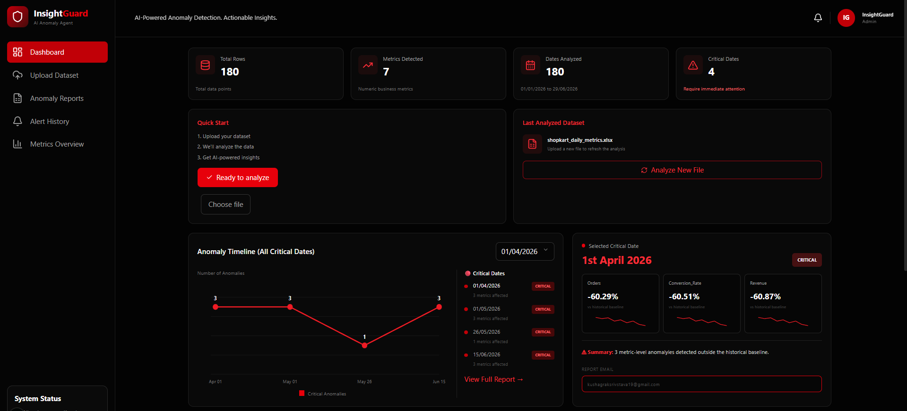
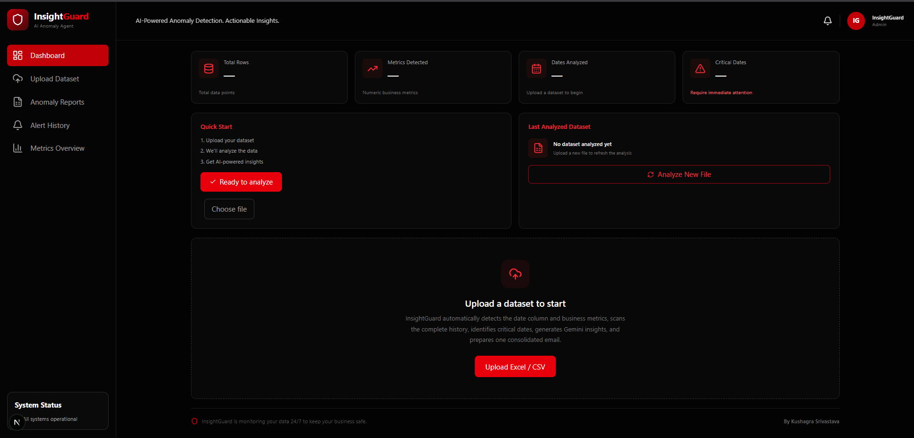
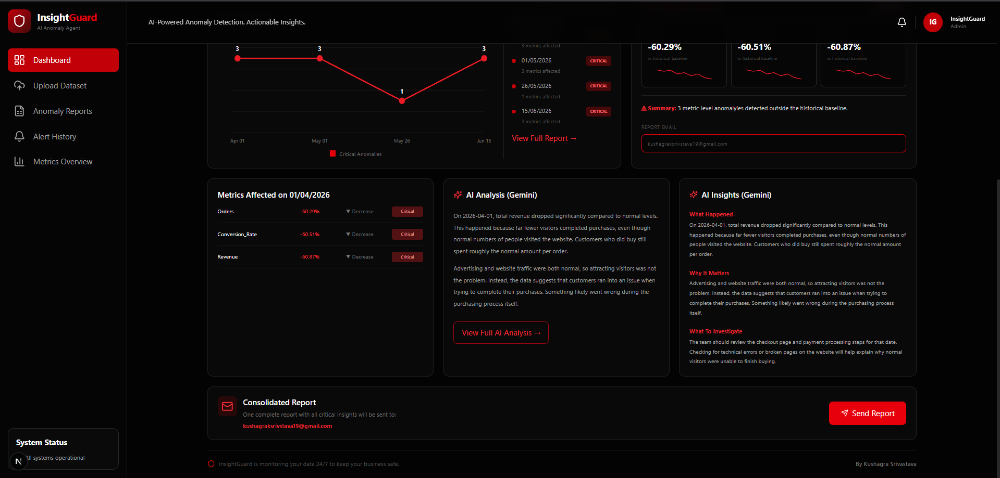
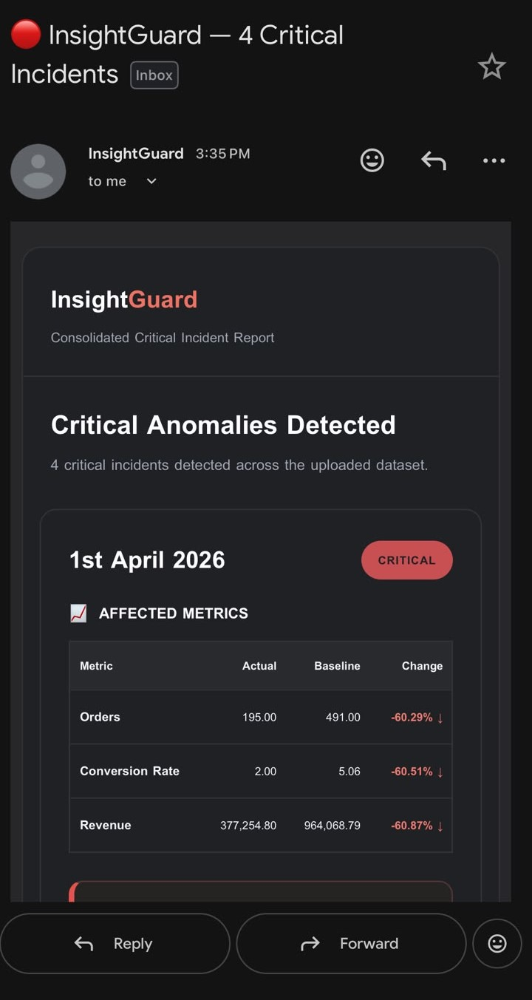
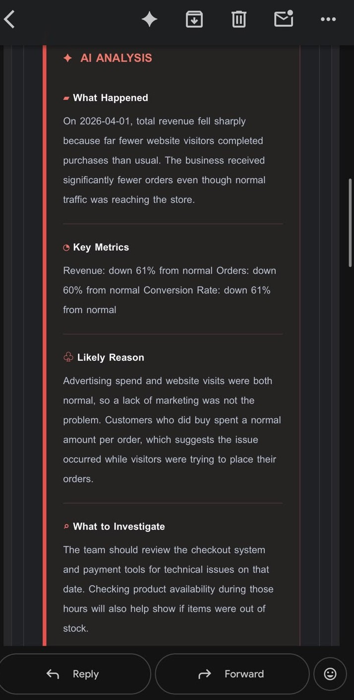

# 🔴 InsightGuard — AI-Powered Anomaly Detection Agent

> **Detect anomalies. Understand what happened. Know what to investigate next.**

InsightGuard is an end-to-end **AI-powered anomaly detection and business analytics system** that automatically analyzes uploaded datasets, identifies critical anomalies, generates contextual AI explanations, and recommends investigation steps.

Instead of simply telling a business that **"something went wrong,"** InsightGuard attempts to explain:

* 🔎 **What happened?**
* 📊 **Which metrics were affected?**
* 🤖 **Why might it have happened?**
* 🧭 **What should be investigated next?**
* 📧 **How can the findings be communicated automatically?**

---

## 🚀 Live Demo

**Live Application:**
https://insightguard-ai-agent.vercel.app/

> The deployed application provides the interactive InsightGuard dashboard.

---

## 📸 Application Preview

### Dashboard

The main dashboard provides an overview of the analyzed dataset, detected metrics, analyzed dates, and critical anomaly dates.



---

### Dataset Upload

Users can upload an Excel or CSV dataset. InsightGuard automatically processes the uploaded data and begins the anomaly analysis workflow.



---

### Anomaly Detection Dashboard

Detected critical dates and affected metrics are presented through an interactive dashboard.

The system highlights the magnitude of deviations from historical baselines and allows users to inspect individual anomaly events.



---

### AI-Powered Analysis

For every significant anomaly, InsightGuard generates contextual AI analysis covering:

* **What Happened**
* **Key Metrics**
* **Likely Reason**
* **What to Investigate**



---

### Automated Email Report

InsightGuard can consolidate critical incidents into an email report so that important findings can be communicated without requiring users to continuously monitor the dashboard.



---

# 🎯 Problem Statement

Traditional anomaly detection systems are often focused on identifying unusual values.

For example:

> Revenue decreased by 60%.

While this is useful, it still leaves the analyst with several questions:

> Why did revenue decrease?

> Which part of the business caused the change?

> Is the issue related to traffic, conversion, orders, or another factor?

> What should the team investigate?

InsightGuard was designed to bridge this gap between **anomaly detection and actionable investigation**.

---

# 💡 Solution

InsightGuard combines automated anomaly detection with AI-generated analytical reasoning.

The system follows this workflow:

```text
        Upload Business Dataset
                 │
                 ▼
        Data Processing
                 │
                 ▼
        Metric Detection
                 │
                 ▼
       Historical Baseline
             Analysis
                 │
                 ▼
       Anomaly Detection
                 │
                 ▼
       Critical Incidents
                 │
                 ▼
        AI-Powered Analysis
                 │
        ┌────────┴─────────┐
        ▼                  ▼
   Explanation      Investigation Steps
        │                  │
        └────────┬─────────┘
                 ▼
          Web Dashboard
                 │
                 ▼
       Consolidated Email
             Report
```

---

# ✨ Key Features

## 1. 📂 Dataset Upload

Users can upload business datasets in:

* Excel (`.xlsx`)
* CSV (`.csv`)

InsightGuard processes the uploaded data and automatically begins the analysis pipeline.

---

## 2. 📊 Automatic Metric Detection

The system analyzes the uploaded dataset and identifies relevant numerical business metrics.

Examples include:

* Revenue
* Orders
* Conversion Rate
* Website Visits
* Advertising Spend
* Average Order Value

This allows the system to work with business datasets without requiring every metric to be manually configured.

---

## 3. 🔎 Anomaly Detection

InsightGuard compares observed metric values against historical behavior and identifies significant deviations.

For every detected anomaly, the dashboard can display:

| Information | Description                        |
| ----------- | ---------------------------------- |
| Date        | Date on which the anomaly occurred |
| Metric      | Affected business metric           |
| Actual      | Observed value                     |
| Baseline    | Historical expected value          |
| Change      | Percentage deviation               |
| Severity    | Criticality of the anomaly         |

---

## 4. 🚨 Critical Incident Detection

Multiple metric anomalies can occur on the same date.

InsightGuard groups these events into critical incidents, allowing users to understand the broader business impact rather than examining isolated metrics individually.

For example:

```text
1 April 2026

Orders          ↓ 60.29%
Conversion Rate ↓ 60.51%
Revenue         ↓ 60.87%

              ↓

       Critical Incident
```

---

# 🤖 AI-Powered Analysis

One of InsightGuard's main goals is to move beyond traditional anomaly detection.

When an anomaly is detected, the system generates contextual AI analysis.

The analysis is structured around four key questions:

### What Happened?

Provides a natural-language explanation of the observed anomaly.

### Key Metrics

Summarizes the most important changes associated with the incident.

### Likely Reason

Uses the available business context and relationships between metrics to identify plausible explanations.

### What to Investigate

Provides practical investigation directions for the analyst or business team.

---

## Example AI Analysis

For a critical revenue anomaly, InsightGuard can produce analysis such as:

```text
What Happened

Total revenue dropped significantly compared to normal
levels because fewer website visitors completed purchases.

Key Metrics

Revenue: down approximately 61%
Orders: down approximately 60%
Conversion Rate: down approximately 61%

Likely Reason

Advertising spend and website traffic remained normal,
suggesting that the problem was not primarily caused by
a lack of incoming visitors.

What to Investigate

Review the checkout system and payment processing flow
for technical issues and investigate product availability
during the affected period.
```

This transforms a raw anomaly into an **investigation starting point**.

---

# 📧 Automated Email Reporting

InsightGuard can generate a consolidated critical incident report and send it through email.

The email contains:

* Critical incident dates
* Affected metrics
* Actual values
* Historical baselines
* Percentage changes
* AI-generated analysis
* Investigation recommendations

This enables stakeholders to receive important insights without continuously checking the dashboard.


The AI analysis is included directly within the report:


---

# 📈 Dashboard

The InsightGuard dashboard provides a centralized view of the analytical results.

### Dashboard metrics include:

* Total rows analyzed
* Number of metrics detected
* Number of dates analyzed
* Number of critical dates
* Anomaly timeline
* Critical incident list
* Affected metrics
* AI analysis
* AI insights
* Email reporting


---

# 🧭 Anomaly Investigation Workflow

The application is designed around a simple analyst workflow:

### Step 1 — Upload

Upload an Excel or CSV business dataset.

### Step 2 — Analyze

InsightGuard processes the dataset and identifies relevant business metrics.

### Step 3 — Detect

The system identifies significant deviations from historical behavior.

### Step 4 — Understand

AI-generated analysis explains the detected anomaly.

### Step 5 — Investigate

The system recommends areas that should be investigated.

### Step 6 — Report

Critical incidents can be consolidated into an email report.

---

# 🏗️ Project Architecture

```text
                         ┌──────────────────┐
                         │  Excel / CSV     │
                         │     Dataset      │
                         └────────┬─────────┘
                                  │
                                  ▼
                    ┌─────────────────────────┐
                    │    Data Processing      │
                    │    & Metric Analysis    │
                    └────────────┬────────────┘
                                 │
                                 ▼
                    ┌─────────────────────────┐
                    │   Anomaly Detection      │
                    │         Engine           │
                    └────────────┬────────────┘
                                 │
                                 ▼
                    ┌─────────────────────────┐
                    │   Critical Incidents     │
                    │       & Metrics          │
                    └────────────┬────────────┘
                                 │
                                 ▼
                    ┌─────────────────────────┐
                    │      AI Analysis         │
                    │        (Gemini)           │
                    └────────────┬────────────┘
                                 │
                     ┌───────────┴───────────┐
                     ▼                       ▼
             ┌───────────────┐       ┌──────────────┐
             │ Web Dashboard │       │ Email Report │
             └───────────────┘       └──────────────┘
```

---

# 🛠️ Tech Stack

## Frontend

* Next.js
* React
* TypeScript
* Responsive web UI
* Data visualization components

## Data & Analysis

* Python
* Pandas
* Numerical/data processing
* Historical baseline analysis
* Anomaly detection

## Artificial Intelligence

* Google Gemini
* AI-generated anomaly explanations
* AI-generated investigation recommendations

## Communication

* Email reporting
* Consolidated critical incident reports

## Deployment & Development

* Git
* GitHub
* VS Code
* Vercel

---

# 📁 Project Structure

```text
InsightGuard-AI-AGENT/
│
├── backend/
│   ├── ...
│   └── Python analysis engine
│
├── frontend/
│   ├── ...
│   └── Next.js application
│
├── data/
│   └── Project datasets
│
├── docs/
│   └── screenshots/
│       ├── dashboard-empty.png
│       ├── dashboard-analysis.png
│       ├── anomaly-dashboard.png
│       ├── email-report.png
│       └── email-ai-analysis.png
│
├── .env.example
├── .gitignore
└── README.md
```

---

# ⚙️ Installation

## Prerequisites

Make sure you have installed:

* Python 3.x
* Node.js
* npm
* Git

---

## 1. Clone the Repository

```bash
git clone https://github.com/kush-019/InsightGuard-AI-AGENT.git

cd InsightGuard-AI-AGENT
```

---

## 2. Backend Setup

Navigate to the backend:

```bash
cd backend
```

Create a Python virtual environment:

```bash
python -m venv venv
```

Activate it on Windows:

```bash
venv\Scripts\activate
```

Install the required dependencies:

```bash
pip install -r requirements.txt
```

---

## 3. Environment Variables

Create a `.env` file using `.env.example` as a template.

Example:

```env
GEMINI_API_KEY=
EMAIL_USERNAME=
EMAIL_PASSWORD=
```

⚠️ **Never commit your actual `.env` file or API credentials to GitHub.**

---

## 4. Start the Backend

Run the backend using the startup command defined by the project.

For example:

```bash
python app.py
```

---

## 5. Frontend Setup

Open another terminal and navigate to:

```bash
cd frontend
```

Install dependencies:

```bash
npm install
```

Start the development server:

```bash
npm run dev
```

Open:

```text
http://localhost:3000
```

---

# 🔐 Security

InsightGuard uses environment variables for sensitive configuration.

The following should **never** be committed:

```text
.env
API keys
Email passwords
Email app passwords
Private credentials
Deployment secrets
```

A `.env.example` file should contain placeholders only.

Example:

```env
GEMINI_API_KEY=
EMAIL_USERNAME=
EMAIL_PASSWORD=
```

---

# 📊 Example Incident

One of the dashboard scenarios demonstrates a critical incident where several business metrics dropped simultaneously.

```text
                Critical Incident
                       │
        ┌──────────────┼──────────────┐
        │              │              │
        ▼              ▼              ▼
      Orders      Conversion Rate   Revenue
       -60.29%        -60.51%        -60.87%
        │              │              │
        └──────────────┼──────────────┘
                       ▼
                AI Investigation
                       │
                       ▼
             Checkout / Payment
             System Investigation
```

The important insight is that the system does not stop at identifying the decline.

It attempts to connect the affected metrics and provide a **business-oriented investigation path**.

---

# 🎯 Project Objectives

InsightGuard was built to demonstrate how AI can enhance traditional data analytics workflows.

The primary objectives were:

* Automate anomaly detection
* Reduce manual monitoring
* Explain abnormal business behavior
* Provide actionable investigation recommendations
* Present insights through an intuitive dashboard
* Automate critical incident reporting
* Connect data analytics with generative AI

---

# 🔮 Future Improvements

Potential future improvements include:

* [ ] User authentication and role-based access
* [ ] Historical anomaly tracking
* [ ] Configurable anomaly thresholds
* [ ] Anomaly severity scoring
* [ ] More advanced statistical detection techniques
* [ ] Multiple AI model support
* [ ] Slack/Teams notifications
* [ ] Scheduled dataset analysis
* [ ] Automated daily/weekly reports
* [ ] Advanced anomaly correlation
* [ ] Business-specific investigation playbooks
* [ ] Production monitoring and observability

---

# 🌟 Why InsightGuard?

InsightGuard is designed around a simple idea:

> **Detection is only the beginning of investigation.**

A traditional alert might tell an analyst:

```text
Revenue ↓ 60%
```

InsightGuard attempts to turn that into:

```text
Revenue ↓ 60%

        ↓

Orders ↓ 60%
Conversion Rate ↓ 61%

        ↓

Traffic remained normal

        ↓

Potential issue in the purchasing process

        ↓

Investigate:
• Checkout system
• Payment processing
• Product availability
```

This creates a workflow from:

**Data → Detection → Explanation → Investigation → Action**

---

# 👨‍💻 Author

## Kushagra Srivastava

B.Tech — Computer Science / Data Analytics

Interested in:

* Data Analytics
* Business Intelligence
* Artificial Intelligence
* Data Engineering
* Full-Stack Development

GitHub:
https://github.com/kush-019

---

# 📌 Project Status

**Status:** Active Development

InsightGuard is a portfolio project demonstrating the integration of:

**Data Analytics + Anomaly Detection + Generative AI + Full-Stack Development + Automated Reporting**

---

## ⭐ If you find the project interesting

Feel free to explore the repository, try the application, or provide feedback.

**InsightGuard — Turning anomalies into actionable insights.**
